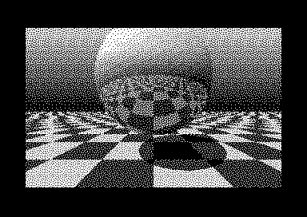

# cc64-web

A JavaScript reimplementation of [cc64](https://github.com/pzembrod/cc64) —
Philip Zembrod's small-C compiler for the Commodore 64 — running natively in
the browser and producing standard C64 `.prg` files, with one-click handoff
to [Web64](https://web64.nofs.ai) (Mika Jussila's browser VICE port).

**Live: https://rpi6.memention.net/cc64-web/** — write C, press Compile,
press *Run in Web64*.

The original cc64 is 6502 machine code (written in VolksForth) that runs
*on* the C64, so there was nothing to compile to WASM. This project rebuilds
the whole pipeline — scanner, preprocessor, parser, code generator,
minilinker — in dependency-free ESM JavaScript, reusing cc64's release
runtime modules (`assets/rt/`) as binary inputs.

## The prime directive: byte-identity

Output is **byte-identical to real cc64**. The reference implementation is
cc64 itself running headlessly in VICE (`tools/oracle/`); the golden PRGs it
produces are the test targets. Four fixtures — helloworld, sieve,
printf/libc, and a torture test (switch, function pointers, prototypes,
`?:`, `&&`/`||`, pointer arithmetic) — compile to the same bytes as the
real thing (`npm test`).

Everything from the Forth source is ported faithfully, including the odd
corners: `>>` is an arithmetic shift, `/` and `%` floor toward −∞, string
literals are PETSCII, small `#define`s are char-typed, static init data is
emitted hi-byte-first into a reversed stream. `docs/PLAN.md` has the full
Forth→JS port map and fidelity notes.

## Extensions (clearly fenced off)

Two additions real cc64 rejects, documented as deliberate divergences —
golden output is untouched unless a source opts in:

- **`__zeropage`** storage class — file-scope variables allocated in
  $57–$70 (the BASIC FP work area, free while only the KERNAL is called),
  addressed with zero-page opcodes: one cycle and one byte less per access.
- **`__asm { ... }`** inline assembly (`src/asmblock.js`) — a full
  line-oriented 6502 assembler inside function bodies: local labels,
  `symbol+offset` operands (self-modifying code works), `#<`/`#>`,
  `.byte`/`.word`, automatic zp/abs selection, and identifiers that resolve
  to C globals and `#define` constants through the compiler's symbol table.

## The raytracer



`examples/raytracer/` is the proving ground: a mirror sphere over a
checkered floor (a C port of an assembly original), 320×200 hires,
blue-noise dithered, all math in 8.8 fixed point. The optimization log in
its README walks from a naive ~2 hours per frame down to **5.1 minutes on a
stock PAL C64 — 22% faster than the hand-written assembly original** —
using the extensions above: quarter-square multiply with self-modifying
table lookups in `__asm`, long-division `fdiv`, and the zeropage pool
filled to the last byte. Every step verified pixel-identical against a JS
model of the algorithm.

## Tooling

- `tools/run6502.mjs` — minimal NMOS 6502 interpreter with **cycle-exact
  timing** (page-cross and branch penalties), used for semantic probing and
  benchmarks: `make bench PRG=file.prg`.
- `tools/profile6502.mjs` — per-function profiler: compiles a file or a
  whole project dir, runs it, attributes every instruction and cycle by
  address, resolves the runtime's `$mult`/`$divmod`/`$shl`/`$shr` helpers
  by name from its jump table, and follows cc64's prototype jmp stubs when
  counting calls: `make profile SRC=examples/raytracer`.
- `tools/oracle/` — the VICE pipeline that builds golden PRGs from real
  cc64 (`make golden SRC=... CC64_REPO=<cc64 checkout>`).
- `src/d64.js` / `src/petscii.js` — 1541 disk images (validated against
  `c1541`) and ASCII↔PETSCII, supporting the oracle.

## The browser IDE

```bash
npm run web    # -> http://localhost:8064/web/
```

`web/index.html` is a zero-dependency IDE: multiple named projects in
localStorage, a files rail with the bundled cc64 headers, syntax
highlighting driven by the compiler's real keyword list, a brace-depth
formatter, and unity builds (`src/amalgamate.js` concatenates the
project's `.c` files with hoisted, deduped includes). Projects export and
import as `.cc64proj.json` — `examples/raytracer/mkproject.mjs` builds one
for the raytracer.

### Handoff to Web64

The deployed instance keeps compiled PRGs **in memory** for 5 minutes
(`server/cc64web_server.py`, ~180 lines of Python stdlib) and hands Web64 a
fetchable URL via its `?url=` autostart, warp enabled during load:

    compile → POST api/prg → open web64.nofs.ai/?url=<prg-url>&warp=true

Locally, the program row is draggable straight onto a Web64 tab
(Chromium's `DownloadURL` drag becomes a real file drop), or download the
`.prg`. Deployment bits live in `deploy/`.

## Commands

```bash
make             # menu of everything below
npm test         # full suite, incl. the byte-identity differential test
npm run web      # dev server for the IDE
make prg SRC=f.c            # compile a file from the CLI
make bench PRG=f.prg        # cycle-exact benchmark
make profile SRC=<f.c|dir>  # per-function cycle profile
make golden SRC=f.c         # build a golden via real cc64 in VICE
```

## Credits

- [Philip Zembrod](https://github.com/pzembrod) — cc64, the real thing.
- [Mika Jussila](https://web64.nofs.ai) — Web64, the browser C64.
- The unported remainder: `link-lib` (library modules for sources without
  `main()`) and cc64's editor/shell/X16 variants — see `docs/PLAN.md`.
