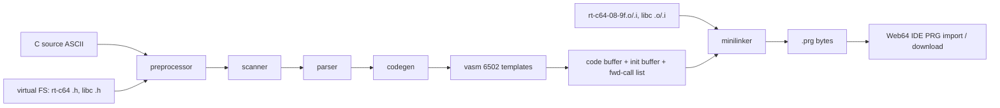

# cc64-web: JS reimplementation of the cc64 compiler

Goal: rebuild cc64 (pzembrod's C64-hosted small-C compiler) as a JavaScript
library that runs in the browser, compiles cc64's C dialect to a standard
C64 `.prg`, and hands it to Web64 (web64.nofs.ai) via its PRG import.

## Fidelity target

Byte-identical output to real cc64 wherever practical. We have a working
oracle: cc64 running in local VICE (see `tools/oracle/`), proven to compile
`helloworld-c64.c` → 747-byte PRG. Differential testing = compile fixtures
both ways, diff the PRGs. Where byte-identity is impractical, behavioural
equivalence (program runs the same) is acceptable — but divergences must be
listed in this file.

Deliberate divergences (extensions — output is byte-identical unless a
source uses them):

- **`__zeropage` storage class** (cc64-web only; real cc64 rejects the
  keyword): `__zeropage int x;` at file scope allocates the variable from
  $57..$70 (BASIC numeric work area + FAC — free while the program only
  calls the KERNAL, which is all cc64's runtime does), and vasm emits
  zero-page addressing for any data address < $100 — so explicit
  `int x *= 0x02;` placements get zp opcodes too (real cc64 always emits
  absolute). No initializers (zp vars are not part of the reversed init
  stream); pool overflow and `__zeropage` functions are compile errors.
  cc64's runtime itself owns $fb-$fe. See `test/zeropage.test.mjs`.
- **`__asm { ... }` inline assembly** (cc64-web only): a statement inside
  function bodies; line-oriented 6502 assembly emitted at the current code
  address (`src/asmblock.js`). Local labels, `;` comments, `#imm`,
  auto zp/abs, `(zp),y`, symbol+offset expressions (self-modifying code),
  `#<`/`#>`, `.byte`/`.word`; identifiers resolve local labels first, then
  C globals / `#define` constants via the symbol table. The closing `}`
  also ends the block mid-line (but a `}` after `;` is comment text);
  raw lines bypass the C scanner (no PETSCII conversion, no `/* */`).
  Clobbers A/X/Y/flags — legal at statement level, where cc64 assumes
  nothing is live. See `test/asmblock.test.mjs` and the raytracer's
  fmul/fdiv/isqrt.

Fidelity rules discovered so far:

- 16-bit ints, all arithmetic wraps at 16 bits.
- Char and string literals are PETSCII bytes in the output (the C64 scans
  PETSCII source). Escape `\n` is 13 (CR), `\f` 12, `\b` 8, `\t` 9, `\r` 13,
  octal escapes `\1..\777` (masked to 8 bits).
- Identifiers: 31 chars significant (`/id`).
- The preprocessor is line-based and primitive: `#include` (nesting via
  file stack), `#define` name value (constant only, no macro bodies),
  `#pragma cc64 <7 numbers> <module-name>` configures the runtime module
  and memory layout.
- `#pragma cc64 0xfd 0xfb 0x801 0x840 0x9ee 0x9ffe 0xa000 rt-c64-08-9f`
  (meaning per doc/Runtime-libs.md: zero-page cells for the local-variable
  stack pointer, load address, code start, first static/end addresses,
  memory top, and the runtime module base name — verify each field against
  the doc before relying on it).

## Port map (Forth source → JS module)

| cc64 source           | lines | JS module            | status |
|-----------------------|-------|----------------------|--------|
| scanner.fth           | 436   | src/scanner.js       | ported ✅ |
| minilinker.fth        | 197   | src/linker.js + src/pragma.js | ported ✅ — round-trips 3 oracle PRGs byte-identical (rt + libc modules); library output (link-lib/.h writing) still todo |
| preprocessor.fth      | 180   | src/preprocessor.js  | ported ✅ — line source for the scanner; #include stack, #define-as-constant (type = int/char + $2000 %extern), #pragma cc64 layout; directives inside comments ignored |
| symboltable.fth       | 205   | src/symtab.js        | ported ✅ — find/put local/global, )block scoping (double-def only within current block), 31-char names, dummy-on-double-def |
| (input.fth line model)| —     | src/frontend.js      | scanner rewritten line-based to match input.fth; frontend wires pp+scanner+symtab |
| v-assembler.fth       | 432   | src/vasm.js          | ported ✅ — every template emits the original's exact bytes (75 pins); 13 signature sequences verified verbatim inside golden PRGs. Runtime jump table: >runtime + $08 jmp(zp) / $0b switch / $0e mult / $11 divmod / $14 shl / $17 shr / $1a jmp(laststatic) / $1d jmp(stack) |
| codegen.fth           | 608   | src/codegen.js       | ported ✅ — (val,type) object model, constant folding, a-used accumulator tracking, vectored binops, pointer scaling (left operand only), calls/fastcalls, ?: && \|\|. Gotcha: `stat,` emits hi byte first (reversed stream → little-endian in memory) |
| parser.fth            | 1098  | src/parser.js        | ported ✅ — full statement/declarator grammar, switch case tables ([label,value] pairs, reverse order, 0-terminated, then jmp default), prototype jmp stubs feeding protos2patch, K&R + ANSI params, static init reversal |
| invoke.fth (cc)       | 49    | src/compile.js       | ported ✅ — front end → parse/codegen → end-of-code → linkExecutable |

**Differential verification: helloworld (747 B), sieve (10108 B),
printf/libc (6742 B) and torture (1675 B — switch, function pointers,
prototypes, ?:, logical ops, pointer arithmetic) all compile
BYTE-IDENTICAL to real cc64** (`node test/compile.test.mjs`).
Remaining: `link-lib` (library-module output, e.g. kernal-io-c64.c which
has no main()) and the peddi/X16/C16 side branches, deliberately skipped.
| strtab.fth, memman.fth, fileio/fileman | — | folded into the above / virtual FS | todo |

Not ported: shell, peddi editor, profiler, savesystem, X16/C16 variants.

## Architecture

- Single pass, like the original: code is emitted at absolute addresses
  starting after the runtime module; statics allocated from memory top
  downwards; init values collected in reverse order and appended by the
  linker; forward function calls patched at the end.
- Everything browser-friendly: pure ESM, no Node APIs in `src/`,
  virtual FS = Map(name → bytes) preloaded with `assets/rt/*`.

## Milestones

1. **Scanner** — port + fixture tests (token stream snapshots). ✅
2. **Preprocessor + symbol table** — `#pragma cc64` parsing, include chain,
   global/local scope handling.
3. **Linker first, then codegen** (linker is small and testable alone:
   linking rt-c64 with zero user code must yield a valid PRG stub).
4. **v-assembler templates + codegen + parser** — the big one; port
   template-by-template, statement-by-statement.
5. **Differential test suite** — all `test/fixtures/*.c` compile
   byte-identical to the VICE oracle (`tools/oracle/`).
6. **Web integration** — worker + small UI: editor → compile → download
   .prg / hand to Web64 IDE import; later a `compilerBackend: "cc64"`
   proposal for the Web64 author. ✅ deployed at
   https://rpi6.memention.net/cc64-web/ (deploy/): apache endpoints.d →
   python-stdlib server on :9007 serving the static IDE + an in-memory
   PRG stash (`POST api/prg` → 5-min URL). The "Run in Web64" button
   POSTs the compiled PRG and opens `web64.nofs.ai/?file=<prg-url>&autorun=true&warp=true`
   — the url param must be raw, NOT percent-encoded (verified end-to-end:
   sieve compiles in-browser, autostarts in web64, prints 1899 PRIMES).

## Oracle (kept from the earlier bridge work)

`tools/oracle/` retains the proven VICE pipeline: build a compile disk with
the user source injected (src/d64.js + src/petscii.js), boot cc64 in VICE,
extract the reference PRG. Reference PRGs get committed as golden files so
CI doesn't need VICE.
