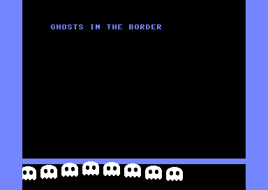

# ghosts — sprites in the border (cc64 C)



Eight little ghosts bob in the **lower border**, below where the 25-row
screen ends — a place the VIC-II normally won't let sprites show. This is
the classic "open border" trick, and it needs a raster **interrupt**, so
it exercises cc64-web's `__asm` inline assembly alongside the `__sprite`
extension.

## The trick

The VIC-II wraps the screen in a border and clips sprites to the inner
rectangle. A vertical-border flip-flop turns the border on when the raster
reaches the **bottom compare** line and off at the **top compare** line —
and those compare values depend on the 25/24-row bit (RSEL, `$d011` bit 3):

| RSEL | rows | top compare | bottom compare |
|------|------|-------------|----------------|
| 1    | 25   | 51          | 251            |
| 0    | 24   | 55          | 247            |

If we sit in 25-row mode as the raster passes 247, then switch to 24-row
**after 247 but before 251**, *neither* bottom compare fires — the
flip-flop is never set and the VIC keeps drawing background and sprites
straight down through the border. (The same flip-flop governs the top, so
both the top and bottom borders open; only the side borders remain.)

Two raster interrupts keep it going every frame:

- **`irqa`** fires around line 250 → switch to 24-row mode, then arm the
  next interrupt near the top.
- **`irqb`** fires around line 40 → restore 25-row mode so the next frame
  approaches line 247 in 25-row mode again.

Both are installed by hand in an `__asm` block: mask the CIA timer
interrupts (`$dc0d`/`$dd0d`), enable raster interrupts (`$d01a`), point the
KERNAL IRQ vector (`$0314`/`$0315`) at the handlers, and exit each handler
through `$ea81` (pull A/X/Y, `rti`). The handlers are emitted *before* the
setup code so their addresses are backward references when the setup does
`lda #<irqa` / `lda #>irqa`.

## The ghosts

One hires `__sprite` (a white ghost with transparent eye holes), copied to
sprite block 128 (`$2000`) and shown by all eight sprites at once. Each frame the main
loop reads a 32-entry sine table (`bob[]`) with a per-sprite phase offset
and writes the sprite Y registers, so the ghosts ripple as a wave. They
sit at Y ≈ 246–254, straddling and dipping below the floor bar drawn on
the last text row.

## Build

```bash
node examples/ghosts/mkproject.mjs
```

compile-checks with the compiler, writes `ghosts.prg`, and joins the
source into `ghosts.cc64proj.json` — import that in the cc64-web page
(⤒ button in the project bar). The border trick and interrupts need real
VIC-II timing, so run it in Web64 (or on a C64); the pure-CPU harness in
`tools/run6502.mjs` has no VIC and can't show it.

## Notes

- Positions keep every sprite X < 256 (base 20, step 30), so no `$d010`
  X-high-bit bookkeeping is needed.
- The KERNAL IRQ vector is replaced, so RUN/STOP no longer breaks the
  program — reset (or RUN/STOP+RESTORE) to exit.
- Forward `#<label` / `#>label` immediates (used by `irqa`, which
  references `irqb` defined after it) are resolved by the assembler's
  fixup pass — see `src/asmblock.js`.
