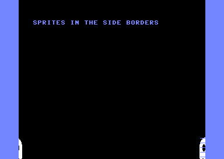

# sideborders — sprites in the left & right borders (cc64 C)



Two ghosts sit in the **left and right borders**, beyond the screen frame —
the hardest of the border tricks, because opening a side border means
performing the 40/38-column switch at an **exact cycle on every raster
line**. It's the counterpart to the lower-border demo in
`examples/ghosts`, and like it, it's written in cc64 C with an `__asm`
interrupt handler.

## The trick

The VIC-II sets the border flip-flop when the raster X reaches the right
compare value, which differs by the 40/38-column bit (CSEL, `$d016` bit 3):
40 columns compares later than 38. If we sit in 40-column mode past the
38-column compare, then flip to 38 columns *before* the 40-column compare,
neither fires — the flip-flop is never set and the VIC keeps drawing to the
screen edges. Skipping the set on one line also leaves the flip-flop clear
for the next line's left edge, so **both** side borders open. It has to be
redone every line, at a ~1-cycle-wide window.

Three things make that window reachable and reliable:

1. **A cycle-stable raster.** A raster interrupt lands with up to 7 cycles
   of jitter. A double interrupt removes it: `irq1` fires a line early,
   points the vector at `irq2` and sleeps in a NOP sled; `irq2`'s `txs`
   discards the jittered stack frame, and a 3-cycle `bit` nudges the phase
   onto the window. From there a loop that is **exactly 63 cycles per line**
   holds the phase, toggling `$d016` at the same cycle every line.

2. **No badlines.** Badlines steal ~40 cycles from a line and would wreck
   the fixed timing, so the whole thing runs inside the lower border (opened
   first with the 24-row RSEL trick, as in `examples/ghosts`), where there
   are none.

3. **Uniform sprite DMA.** The VIC steals cycles from the CPU on the lines a
   sprite is shown, shifting the timing. If sprites covered only part of the
   opened band, those lines would mistime and the border would clip exactly
   where the sprite is. So the two ghosts are **Y-expanded** (`$d017`) to
   ~42 px, filling the band, and the NOP counts are calibrated *with them
   present* — every opened line then sees the same 2-sprite DMA. (This is
   the "the sprites have to be there or the timing is different" caveat you
   will find in every write-up of this effect.)

The tuning constants (the sled length, the `bit` align, and the per-line
NOP split around the `$d016` write) are specific to this sprite layout on a
PAL machine; change the sprite count, positions, or expansion and they must
be re-tuned.

## Build

```bash
node examples/sideborders/mkproject.mjs
```

compile-checks with the compiler, writes `sideborders.prg`, and joins the
source into `sideborders.cc64proj.json` — import that in the cc64-web page
(⤒ button). It needs real VIC-II timing, so run it in Web64 or on a C64;
the pure-CPU harness in `tools/run6502.mjs` has no raster or sprite DMA.

## Notes

- The `$d016` write is timed for PAL (63 cycles/line). NTSC (65 cycles)
  would need different NOP counts.
- The KERNAL IRQ vector is replaced, so RUN/STOP no longer breaks the
  program — reset to exit.
- Why it actually works, read from the emulator that reproduces it:
  [how-vice-models-the-side-border-bug.md](how-vice-models-the-side-border-bug.md)
  traces VICE's two border flip-flops and the CSEL-gated compare cycles.
