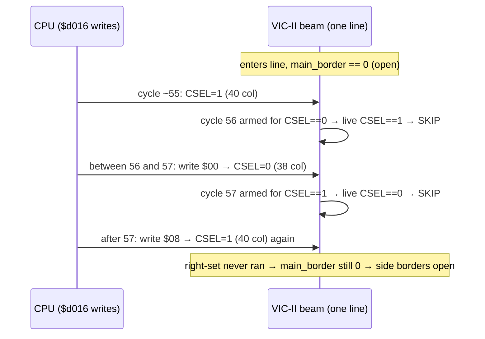

# How VICE models the side-border "bug"

A companion to [`README.md`](README.md): where the demo explains *what* to do
on the CPU side, this card explains *why it works* by reading the emulator
that reproduces it. The `sideborders` example runs under `x64sc`, whose
cycle-exact VIC-II core is in `vice-emulator/vice-3.9/src/viciisc/`. Tracing
four files shows the border trick isn't a special case in VICE at all — it
falls straight out of a faithful model of the two border flip-flops.

## The real chip: two flip-flops, not a "border region"

The VIC-II doesn't store "where the border is". It carries two 1-bit
flip-flops (per Christian Bauer's *The MOS 6567/6569 video controller*,
section 3.9), and the pixel is border-coloured whenever either is set:

- **Main (horizontal) border flip-flop** — set at a right-edge X compare,
  cleared at a left-edge X compare.
- **Vertical border flip-flop** — set at a bottom-row Y compare, cleared at a
  top-row Y compare. While it is set, the main flip-flop is *held* set.

Both compare positions depend on a register bit: the left/right X compares
move with **CSEL** (40/38 columns, `$d016` bit 3) and the top/bottom Y
compares move with **RSEL** (25/24 rows, `$d011` bit 3). Every open-border
trick is the same idea: move a compare *past the current beam position* so the
matching set never happens.

VICE mirrors this one-for-one in `struct vicii` (`viciitypes.h`):

| chip flip-flop           | VICE field          |
|--------------------------|---------------------|
| main border flip-flop    | `vicii.main_border` |
| vertical border flip-flop (live) | `vicii.vborder` |
| vertical border flip-flop (pending, latched at the bottom compare, applied at the next left compare) | `vicii.set_vborder` |

## The per-cycle border logic

`check_hborder()` runs once per pixel-cycle (`vicii-cycle.c:184`):

```c
static inline void check_hborder(unsigned int cycle_flags)
{
    int csel = vicii.regs[0x16] & 0x08;          /* re-read EVERY cycle */

    /* Left compare: cycle 17 (csel=1) or 18 (csel=0) on PAL */
    if (cycle_is_check_border_l(cycle_flags, csel)) {
        check_vborder_bottom(vicii.raster_line);
        vicii.vborder = vicii.set_vborder;
        if (vicii.vborder == 0) {
            vicii.main_border = 0;               /* left edge opens */
        }
    }
    /* Right compare: cycle 56 (csel=0) or 57 (csel=1) on PAL */
    if (cycle_is_check_border_r(cycle_flags, csel)) {
        vicii.main_border = 1;                   /* right edge closes */
    }
}
```

Two facts in this function are the whole mechanism:

1. **`csel` is sampled fresh from `$d016` on every cycle.** A mid-line write
   to `$d016` is visible to the very next compare — exactly like the real
   register.
2. **The right compare only *sets* the flip-flop; nothing else does.** So if
   you can make the beam pass the right-compare cycle without the compare
   firing, `main_border` simply stays at whatever it was — `0`, i.e. open.

## Why a compare "doesn't fire": the CSEL-gated cycle table

Which cycle is "the" compare is not fixed — it is gated by CSEL, and VICE
encodes that in the cycle table. Each of the 63 PAL cycles carries flag bits
(`vicii-chip-model.c`, table `cycle_tab_pal`):

```
{ Phi2(17), ... ChkBrdL1 },              /* left check, but only when csel==1 */
{ Phi2(18), ... ChkBrdL0 },              /* left check, but only when csel==0 */
{ Phi2(56), ... ChkBrdR0 | ChkSprExp },  /* right check, but only when csel==0 */
{ Phi2(57), ... ChkBrdR1 },              /* right check, but only when csel==1 */
```

The test itself (`vicii-chip-model.h:212`) returns true only when the cycle's
hard-wired CSEL matches the *live* CSEL:

```c
static inline int cycle_is_check_border_r(unsigned int flags, int csel)
{
    if (flags & CHECK_BRD_R) {
        return (flags & CHECK_BRD_CSEL) ? csel : !csel;   /* must match */
    }
    return 0;
}
```

So the right border has **two candidate cycles**, and on any given line at
most one of them is armed:

- cycle **56** fires the right-set **only if CSEL == 0** (38 columns)
- cycle **57** fires the right-set **only if CSEL == 1** (40 columns)

## The dodge, in emulator terms

Stay in **40 columns (CSEL = 1) at cycle 56**, then drop to **38 columns
(CSEL = 0) before cycle 57**:

- cycle 56 sees `csel == 1` → its check wants `csel == 0` → **skipped**
- cycle 57 sees `csel == 0` → its check wants `csel == 1` → **skipped**

Neither right-set runs. `main_border` was already `0` (from the previous
line's left compare, because the *vertical* border is open — see below), so it
stays `0` right through where the right border would be, across HBLANK, and
into the next line's left edge — until the next left compare, which also
leaves it `0`. Both side borders are open. This is exactly the demo's
per-line `$d016` toggle (`main.c`: `#$08` → `#$00` → `#$08` straddling the
cycle-56/57 boundary); the emulator opens the border for the identical reason
the silicon does.

The **left** side of the band opens for a different reason, and the code makes
that explicit: at the left compare, `main_border` is only cleared **if
`vborder == 0`**. In-screen, `vborder` is `1` and the left border is forced;
the demo first opens the *vertical* border with the 24-row RSEL trick
(`check_vborder_bottom` never latches `set_vborder`, so `vborder` stays `0`),
which is what lets the left edge open at all. Side borders therefore require
the vertical border already open — the reason this demo runs the loop inside
the opened lower border.



## Why "the sprites have to be there" is real, not folklore

The loop must hit the cycle-56/57 boundary to the cycle, and sprite DMA steals
cycles from the CPU on the lines a sprite is displayed. In VICE those stolen
cycles are the same cycle-table entries (`BaSprN`, `SprDmaN`) that drive
`ba_low`/DMA; a sprite present on some lines but not others shifts the CPU's
arrival at the toggle by a few cycles on exactly those lines, and the compare
lands on the wrong side. Y-expanding the band sprites so every opened line
carries identical DMA is what makes the timing uniform — the emulator charges
the DMA per line just as the chip does, so the fix is needed in VICE for the
same reason it's needed on hardware.

## One-line summary

VICE has no "draw sprites in the border" feature. It models two border
flip-flops and CSEL-/RSEL-gated compare cycles; the trick is emergent — writing
`$d016` mid-line moves the right compare off the beam so the set never fires,
and the flip-flop the emulator carries stays open exactly as the silicon's
does.

## Source map

| what | file:line |
|------|-----------|
| flip-flop set/clear per cycle | `viciisc/vicii-cycle.c:184` `check_hborder()` |
| vertical compares (RSEL) | `viciisc/vicii-cycle.c:165` `check_vborder_top/bottom()` |
| CSEL-gated compare test | `viciisc/vicii-chip-model.h:204` `cycle_is_check_border_l/r()` |
| PAL cycle table (17/18, 56/57) | `viciisc/vicii-chip-model.c:145` `cycle_tab_pal[]` |
| flip-flop state fields | `viciisc/viciitypes.h:242` `vborder/set_vborder/main_border` |
| border pixel fill | `viciisc/vicii-draw-cycle.c:541` `draw_border8()` |
