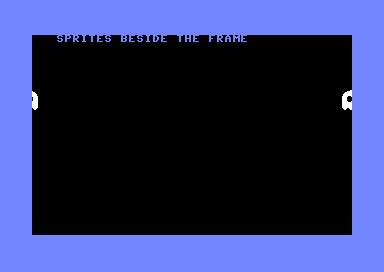

# sideborders2 — sprites beside the frame (left & right borders, at frame height)



Two ghosts sit in the **left and right borders, level with the middle of the
screen** — area D/F below, beside the text frame (E). It's the counterpart to
`examples/sideborders`, which opens the side borders down in the *lower*
border; this one opens them *inside the display window*, which is harder.

```
+-------------------+
|   |   title   |   |
+---+-----------+---+
| D |           | F |   D: ghost at X=4   (left border, Y=105)
|   |           |   |   F: ghost at X=340 (right border, Y=105)
+---+-----------+---+
|   |           |   |
+-------------------+
```

## The per-line trick (the naive part)

Opening a side border means the 40/38-column bit (CSEL, `$d016` bit 3) has to
be switched at an exact cycle on **every** raster line. The recipe (from
[this StackOverflow answer](https://stackoverflow.com/a/1477560)) is naive and
per-line: stay in 40 columns past the 38-column right compare, flip to 38
columns just before the 40-column compare, then flip back — neither compare
fires, so the border flip-flop is never set and both side borders open. A
`bit $02` gives the loop the odd cycle a PAL line (63 cycles) needs. No
counted NOP-sled *delay loop* — just a straight per-line loop.

## Why it needs more than a naive stabiliser

The catch is that the window is about **one cycle wide**, so the raster has to
be cycle-stable. Two things at frame height make that harder than in the lower
border:

1. **Raster jitter.** A raster IRQ lands with up to 7 cycles of jitter. A
   single IRQ plus a "poor man's" `cmp $d012` stabiliser gets that down to
   ~2–3 cycles — but that's still about the width of the window, and in
   practice it only opened *part* of the band (the top lines missed). So this
   uses the **double-interrupt** stabiliser: `irq1` fires a line early, chains
   to `irq2` and sleeps in a NOP sled; `irq2`'s `txs` discards the jittered
   stack frame, leaving a cycle-exact entry. Everything after that is the plain
   naive loop. (Verified: 0 pixels differ between frames in VICE.)

2. **Badlines.** Inside the display window a badline steals ~40 cycles and
   would wreck the per-line timing. Each line rewrites `$d011` YSCROLL to
   `(line&7)^4` (**FLD**), so the badline compare `line&7 == YSCROLL` never
   matches. (Turning the display off instead — `DEN=0` — avoids badlines but
   also stops the side border from opening, so FLD is the way.)

The ghosts are **not** Y-expanded — an expanded sprite fetches data only every
other line, which would make the loop's sprite-DMA cost alternate line by line
— and they sit at Y=105 so the whole 108..124 band is inside their rows, giving
every band line the same 2-sprite DMA.

## Build

```bash
node examples/sideborders2/mkproject.mjs
```

compile-checks with the compiler, writes `sideborders2.prg`, and joins the
source into `sideborders2.cc64proj.json` — import that in the cc64-web page
(⤒ button). It needs real VIC-II timing, so run it in Web64 or on a C64; the
pure-CPU harness in `tools/run6502.mjs` has no raster or sprite DMA.

## Notes

- The sled/prologue lengths and the DA/DB NOP split are tuned for **PAL**
  (63 cycles/line) and for this exact sprite layout. NTSC (65 cycles) or a
  different sprite count/position needs re-tuning.
- The KERNAL IRQ vector is replaced and the CIA interrupts are masked, so
  RUN/STOP no longer breaks the program — reset to exit.
